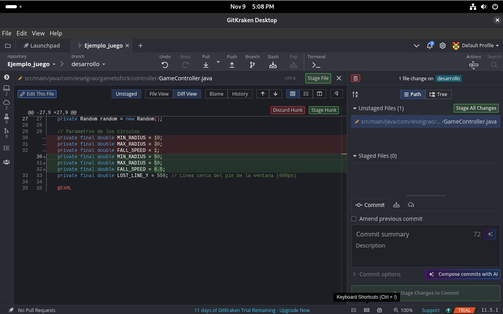
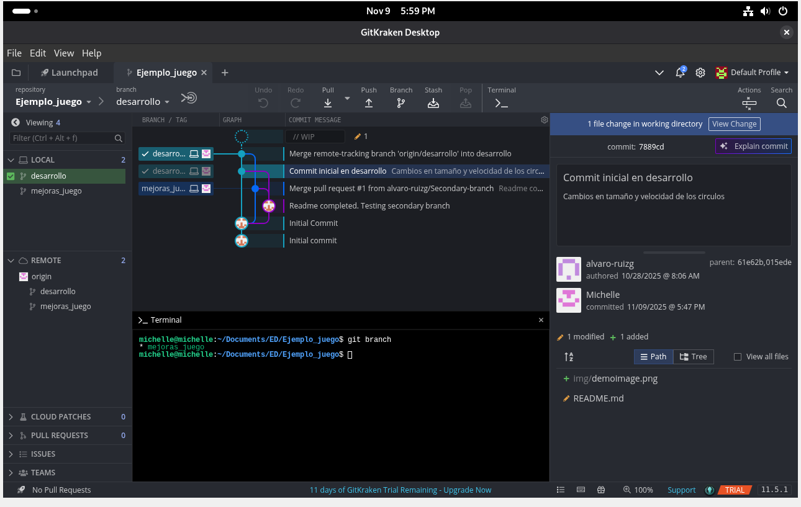
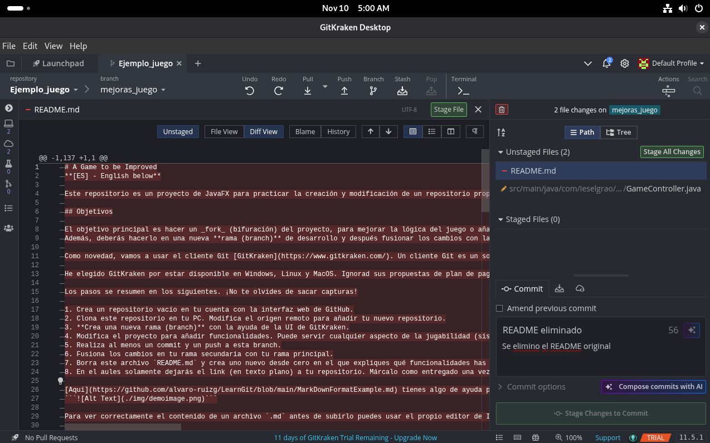
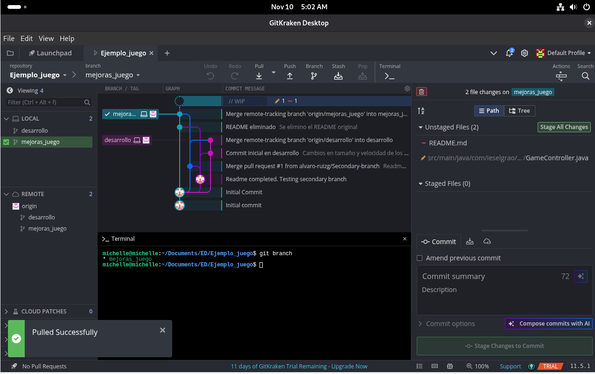

## Mejoras realizadas

- Se **ajustó el tamaño de los círculos** que caen, haciéndolos más variados visualmente.
- Se **aumentó la velocidad de caída**, para hacer el juego más dinámico y desafiante.

Estas mejoras se aplicaron dentro de la clase `GameController.java`.

---

## Proceso de trabajo con GitKraken e Intellij IDEA

1. Se creó un **repositorio vacío** en GitHub.
2. Desde la **máquina virtual Debian**, se **clonó el repositorio propio** utilizando GitKraken.
3. Se **agregó el proyecto base al repositorio clonado**, integrando los archivos del juego y se configuró.
4. Se creó una **rama secundaria llamada `desarrollo`** para realizar las mejoras.
5. Se abrió el proyecto base en **IntelliJ IDEA**
6. Se realizaron los cambios en el código y se hizo un **commit inicial**.
7. Se subió la rama con un **push** al remoto (`origin/desarrollo`).
8. Se **fusionó (`merge`) la rama desarrollo** con la rama principal `mejoras_juego`.
9. Finalmente, se eliminó este README original y se creó este nuevo archivo documentando el proceso.

---

## 📸 Evidencias del trabajo realizado

### 1️⃣ Edición de la velocidad y tamaño
Primera modificación realizada dentro de IntelliJ IDEA.  

---

### 2️⃣ Commit inicial en la rama `desarrollo`
Se guardaron los cambios y se subieron al repositorio remoto.  

---

### 3️⃣ Eliminación del README original
Se eliminó el archivo `README.md` anterior para reemplazarlo por este nuevo.  

---

### 4️⃣ Merge final entre ramas `desarrollo` y `mejoras_juego`
Se fusionaron los cambios de desarrollo en la rama principal.  

---

## 🤖 Uso de IA generativa

Parte de la guía para estructurar este README fue asistida con **ChatGPT (modelo GPT-5, OpenAI, 2025)**.  
Las modificaciones de código y decisiones finales fueron realizadas manualmente.